## Part 1. Установка ОС
*  Вывод версии ОС с помощью команды `cat /etc/issue` \
   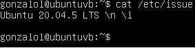

## Part 2. Создание пользователя
*  Команда для создания нового пользователя \
   

*  Вывод команды `cat /etc/passwd` (подчёркнут созданный пользователь) \
   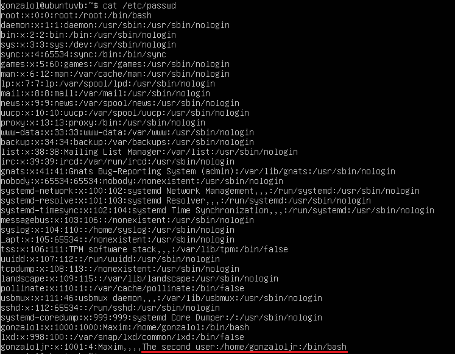

## Part 3. Настройка сети ОС
**1. Задать название машины вида user-1.**
*  Команда: `sudo hostnamectl set-hostname gonzalol-1`

**2. Установить временную зону, соответствующую вашему текущему местоположению.**
*  Команда: `sudo timedatectl set-timezone Europe/Moscow`
*  Результат установки временной зоны : \
   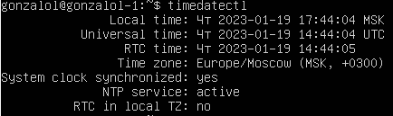

**3. Вывести названия сетевых интерфейсов с помощью консольной команды.**
*  Команда: `ip link show` \
   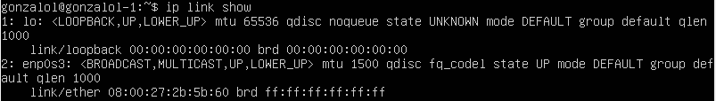
*  Интерфейс lo – виртуальный интерфейс, присутствующий по умолчанию в любом Linux. Это локальный интерфейс, который позволяет программам обращаться к этому компьютеру. Он используется для отладки сетевых программ и запуска серверных приложений на локальной машине.

**4. Используя консольную команду получить ip адрес устройства, на котором вы работаете, от DHCP сервера.**
*  Получаем ip адрес командой `hostname -I` \
   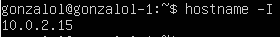
*  DHCP - Dynamic Host Configuration Protocol (Протокол динамической настройки узла). Прикладной протокол, позволяющий сетевым устройствам автоматически получать ip-адрес и другие параметры, необходимые для работы в сети TCP/IP. Данный протокол работает по модели «клиент-сервер». Для автоматической конфигурации компьютер-клиент на этапе конфигурации сетевого устройства обращается к так называемому серверу DHCP и получает от него нужные параметры. Сетевой администратор может задать диапазон адресов, распределяемых сервером среди компьютеров. Это позволяет избежать ручной настройки компьютеров сети и уменьшает количество ошибок. Протокол DHCP используется в большинстве сетей TCP/IP.

**5. Определить и вывести на экран внешний ip-адрес шлюза (ip) и внутренний IP-адрес шлюза, он же ip-адрес по умолчанию (gw)**
*  Получение внешнего ip адреса шлюза командой `curl icanhazip.com`
*  Получение внутреннего ip адреса шлюза командой `ip route`
*  Результат выполнения команд \
   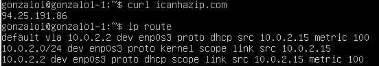

**6. Задать статичные (заданные вручную, а не полученные от DHCP сервера) настройки ip, gw, dns (использовать публичный DNS серверы, например 1.1.1.1 или 8.8.8.8).**
*  Открываем файл конфигураций для редактирования командой `sudo vim /etc/netplan/00-installer-config.yaml` 
*  Файл до редактирования \
   
*  После внесения изменений \
   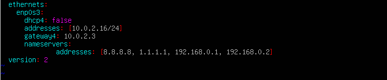
*  Применил изменения командой `sudo netplan apply`

**7. Перезагрузить виртуальную машину. Убедиться, что статичные сетевые настройки (ip, gw, dns) соответствуют заданным в предыдущем пункте.**
*  Перезагрузил машину командой `sudo reboot`
*  Проверил ip машины командой `ip route` \
   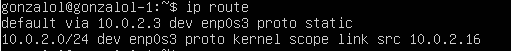
*  Успешно пропинговал командой `ping 1.1.1.1` и `ping ya.ru`. \
   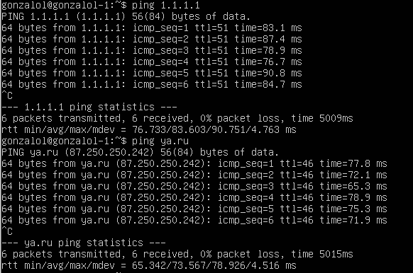

## Part 4. Обновление ОС
**Обновить системные пакеты до последней на момент выполнения задания версии.**
*  Обновляем индексы пакетов системы командой `sudo apt-get update`
*  Обновляем все устаревшие пакеты до последних версий командой `sudo apt-get upgrade` \
   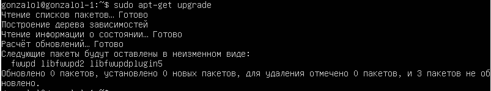

## Part 5. Использование команды sudo
**Разрешить пользователю, созданному в Part 2, выполнять команду sudo.**
*  sudo (англ. Substitute User and do, дословно «подменить пользователя и выполнить») — программа для системного администрирования UNIX-систем, позволяющая делегировать те или иные привилегированные ресурсы пользователям с ведением протокола работы. Команда sudo предоставляет возможность пользователям выполнять команды от имени суперпользователя root, либо других пользователей. Правила, используемые sudo для принятия решения о предоставлении доступа, находятся в файле `/etc/sudoers`.
*  Добавляем пользователя gonzaloljr в группу sudo, команда: `sudo usermod -aG sudo gonzaloljr`
*  Изменение имени машины другим пользователем \
   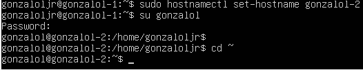

## Part 6. Установка и настройка службы времени
**Настроить службу автоматической синхронизации времени.**
*  Выводим время часового пояса в котором сейчас находимся командой `timedatectl`
*  Вывод команды `timedatectl show` содержит строку `NTPSynchronized=yes` \
   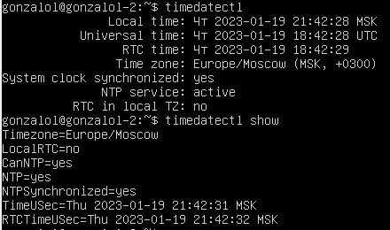

## Part 7. Установка и использование текстовых редакторов
* Так как vim и nano установлены изначально, устанавливаем mcedit командой `sudo apt-get install mcedit`
  

**1. Используя каждый из трех выбранных редакторов, создайте файл test_X.txt, где X -- название редактора, в котором создан файл. Напишите в нём свой никнейм, закройте файл с сохранением изменений.**
*  Содержимое файла test_VIM.txt перед закрытием \
    \
   Для выхода с сохранением изменений вводим `:wq`
  

*  Содержимое файла test_NANO.txt перед закрытием \
   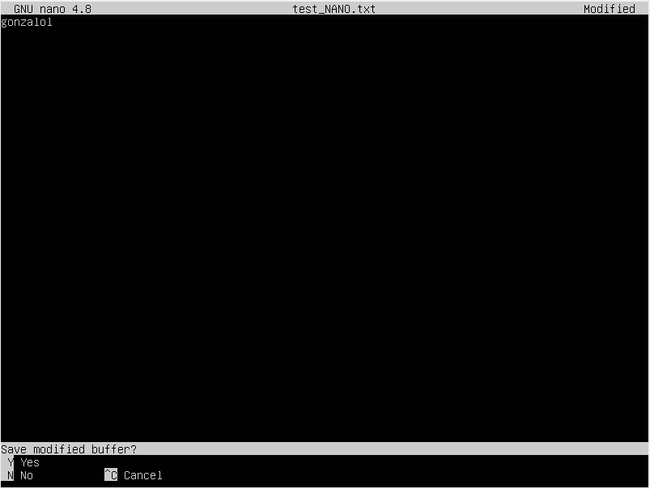 \
   Для выхода с сохранением изменений нажимаем `Ctrl` + `X` затем `Y` и `Enter`
  

*  Содержимое файла test_MCEDIT.txt перед закрытием \
   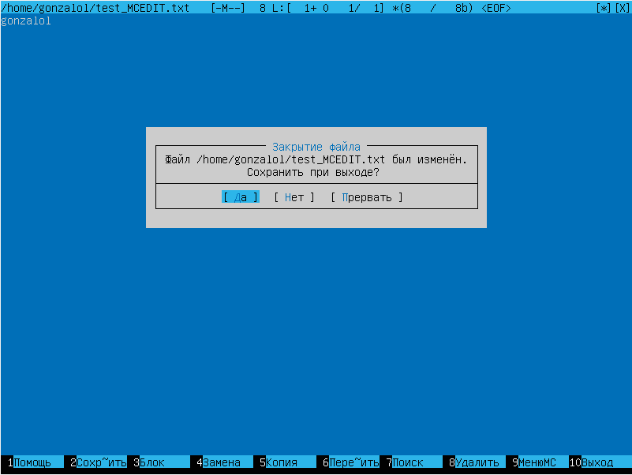 \
   Для выхода с сохранением изменений нажимаем `Esc` и далее в окне подтверждения выбираем `Да`

**2. Используя каждый из трех выбранных редакторов, откройте файл на редактирование, отредактируйте файл, заменив никнейм на строку "21 School 21", закройте файл без сохранения изменений.**
*  Содержимое файла test_VIM.txt после редактирования \
    \
   Для выхода без сохранения изменений вводим `:q!`
  

*  Содержимое файла test_NANO.txt после редактирования \
   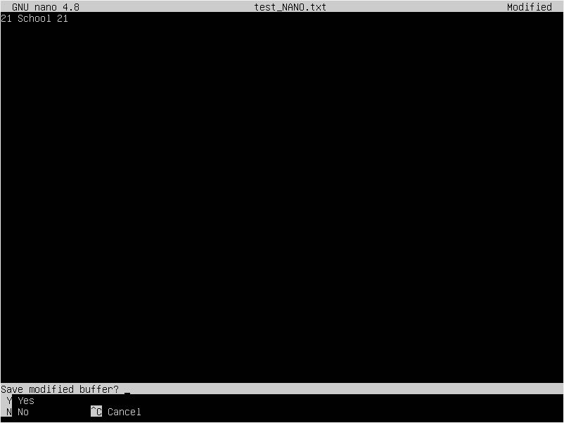 \
   Для выхода без сохранения изменений нажимаем `Ctrl` + `X` затем `N`
  

*  Содержимое файла test_MCEDIT.txt после редактирования \
   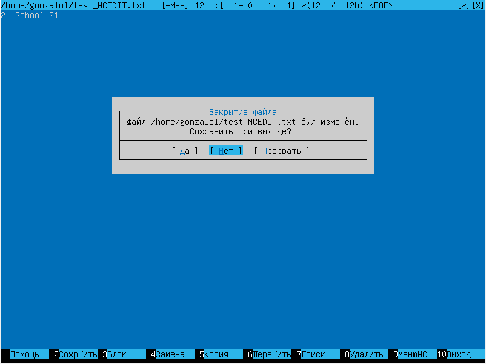 \
   Для выхода без сохранения изменений нажимаем `Esc` и далее в окне подтверждения выбираем `Нет`

**3. Используя каждый из трех выбранных редакторов, отредактируйте файл ещё раз (по аналогии с предыдущим пунктом), а затем освойте функции поиска по содержимому файла (слово) и замены слова на любое другое.**
*  Результат поиска в VIM \
    \
   Для поиска в VIM нажимаем `/` и вводим искомую строку. Совпадение автоматически выделяется.
  

*  Результат поиска в NANO \
   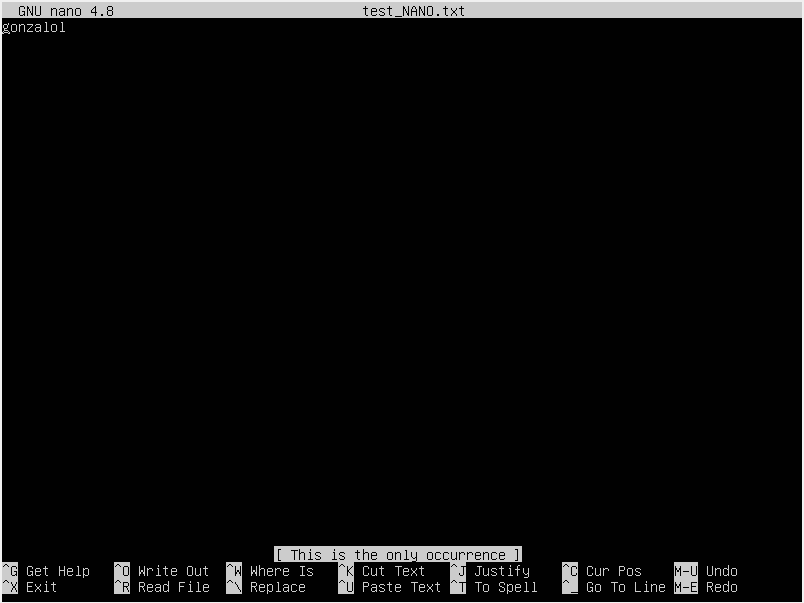 \
   Для поиска в NANO нажимаем `Ctrl` + `W`, затем вводим искомую строку и нажимаем `Enter`. Курсор переместился к началу совпадения в тексте. Снизу появилась информация о количестве совпадений.
  

*  Результат поиска в MCEDIT \
   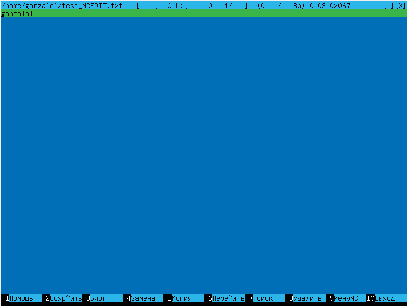 \
   Для поиска в MCEDIT нажимаем `F7`, затем вводим искомую строку и нажимаем `Найти всё`.
  

*  Скриншот из VIM с командой, введённой для замены слова на другое \
    \
   Для замены вводим `:s/gonzalol/21 School 21`
  

*  Скриншоты из NANO с командами для замены слова на другое \
   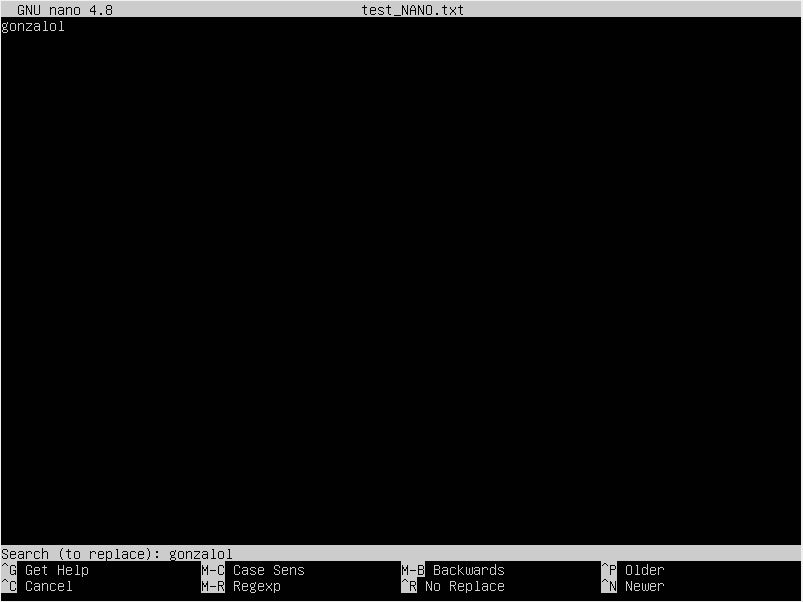 \
   Нажимаем `Ctrl` + ` \ ` и вводим искомую строку \
   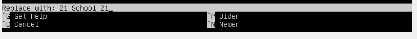 \
   Затем вводим строку, на которую будем заменять \
   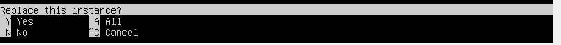 \
   Подтверждаем нажатием `Y`
  

*  Скриншот из MCEDIT с окном для замены слова на другое \
   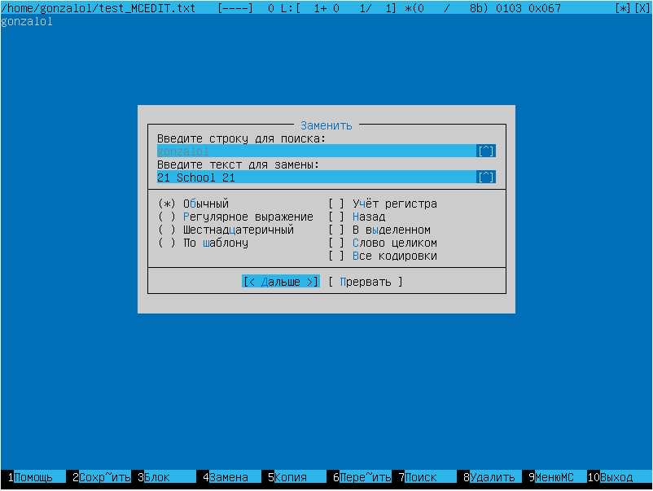 \
   Нажимаем `F4`, вводим искомую строку и строку для замены, выбираем `Дальше` \
   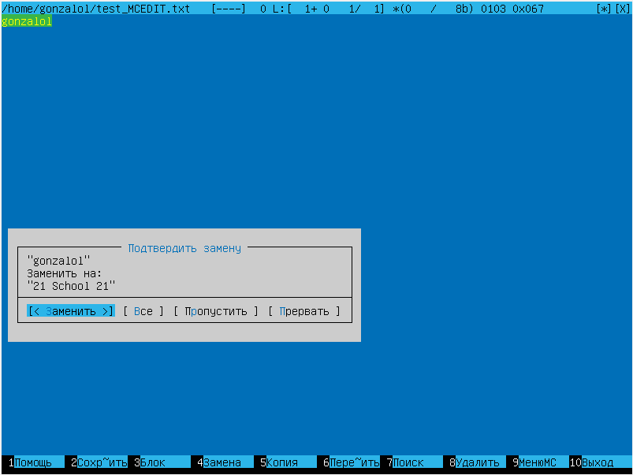 \
   В появившемся окне выбираем `Заменить`
   
## Part 8. Установка и базовая настройка сервиса SSHD
**1. Установить службу SSHd.**
*  Устаналвиваем SSH-сервер в системе командой `sudo apt-get install openssh-server`

**2. Добавить автостарт службы при загрузке системы.**
*  Для включения автостарта службы воспользуемся командой `sudo systemctl enable ssh`

**3. Перенастроить службу SSHd на порт 2022.**
*  Открываем файл конфигураций командой `vim /etc/ssh/sshd_config`
*  В строке, определяющей порт `Port 22` меняем значение на `Port 2022`
*  Раскомментируем строку, удалив символ `#` в начале строки \
   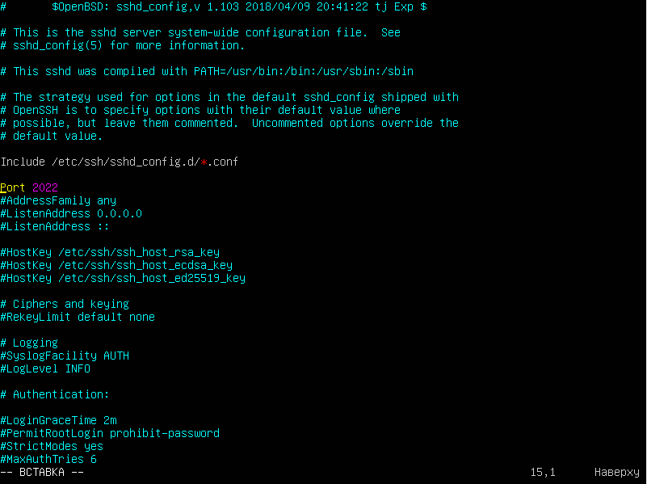
*  Перезапустим службу командой `sudo systemctl restart sshd`

**4. Используя команду ps, показать наличие процесса sshd. Для этого к команде нужно подобрать ключи.**
*  Команда: `ps -ef | grep sshd` \
   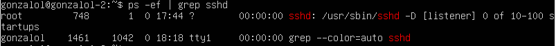 
  

*  ps (processes status — статус процессов) — это встроенная утилита Unix/Linux для просмотра информации, касающейся выбора запущенных процессов в системе: она считывает эту информацию из виртуальных файлов в файловой системе /proc.
  

**Ключи команды ps:**
*  `-A`, `-e` - выбрать все процессы
*  `-a` - выбрать все процессы, кроме фоновых
*  `-d` - выбрать все процессы, даже фоновые, кроме процессов сессий
*  `-N` - выбрать все процессы кроме указанных
*  `-С` - выбирать процессы по имени команды
*  `-G` - выбрать процессы по ID группы
*  `-p` - выбрать процессы PID
*  `--ppid` - выбрать процессы по PID родительского процесса
*  `-s` - выбрать процессы по ID сессии
*  `-t` - выбрать процессы по tty
*  `-u` - выбрать процессы пользователя
*  `-x` - найти все вхождения строки поиска
  
**Опции форматирования:**
*  `-с` - отображать информацию планировщика
*  `-f` - вывести максимум доступных данных, например, количество потоков
*  `-F` - аналогично `-f`, только выводит ещё больше данных
*  `-l` - длинный формат вывода
*  `-j` - вывести процессы в стиле Jobs, минимум информации
*  `-M` - добавить информацию о безопасности
*  `-o` - позволяет определить свой формат вывода
*  `--sort` - выполнять сортировку по указанной колонке
*  `-L` - отображать потоки процессов в колонках LWP и NLWP
*  `-m` - вывести потоки после процесса
*  `-V` - вывести информацию о версии
*  `-H` - отображать дерево процессов.

**5. Перезагрузить систему.**
*  Перезапускаем систему командой `sudo reboot`
*  Устанавливаем утилиту `netstat` с помощью команды `sudo apt-get install net-tools`
*  Вывод команды `netstat -tan` \
   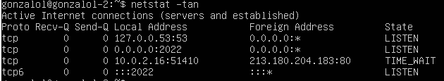 \
   В выводе присутствует строка `tcp 0 0 0.0.0.0:2022 0.0.0.0:* LISTEN`
  

**Значения ключей -tan, каждого столбца вывода и 0.0.0.0**
*  `-t` - Отображение текущего подключения в состоянии переноса нагрузки с процессора на сетевой адаптер при передаче данных.
*  `-a` - Отображение всех подключений и ожидающих портов.
*  `-n` - Отображение адресов и номеров портов в числовом формате.
*  `Proto` - протокол (tcp, udp, raw), используемый сокетом. TCP/IP — сетевая модель передачи данных, представленных в цифровом виде. Модель описывает способ передачи данных от источника информации к получателю.
*  `Recv-Q` - счётчик байт не скопированных программой пользователя из этого сокета.
*  `Send-Q` - счётчик байт, не подтверждённых удалённым узлом.
*  `Local Address` - адрес и номер порта локального конца сокета.
*  `Foreign Address` - адрес и номер порта удалённого конца сокета.
*  `State` - Состояние сокета. LISTEN - Сокет ожидает входящих подключений. ESTABLISHED - Сокет находится в состянии установленного подключения.
*  Адрес 0.0.0.0 означает «любой IP данного компьютера» и включает в себя в том числе 127.0.0.1. Адрес 0.0.0.0 обычно означает, что IP адрес ещё не настроен или не присвоен. Такой адрес указывает хост, который обращается к DHCP для получения IP адреса.

## Part 9. Установка и использование утилит top, htop
*  Так как утилиты уже установлены, запускаем утилиту top командой `top` \
   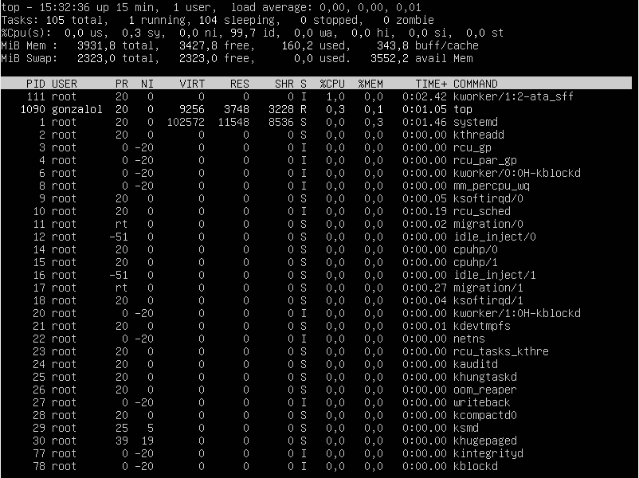
  

*  Uptime - 15 минут \
   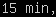
  

*  Количество авторизованных пользователей - 1 \
   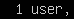
  

*  Общая нагрузка системы представлена в виде средних значений за 1, 5 и 15 минут - 0.00, 0.00, 0.01 \
   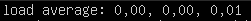
  

*  Общее количество процессов - 105 \
   
  

*  Загрузка CPU: 
   - `us` — процент использования центрального процессора пользовательскими процессами - 0.0
   - `sy` — процент использования центрального процессора системными процессами - 0.3
   - `ni` — процент использования центрального процессора процессами с приоритетом, повышенным при помощи вызова - 0.0
   - `id` — процент времени, когда центральный процессор не используется - 99.7
   - `wa` — процент использования центрального процессора процессами, ожидающими завершения операций ввода-вывода - 0.0
   - `hi` - Hardware IRQ (аппаратные прерывания) — процент использования центрального процессора обработчиками аппаратных прерываний - 0.0
   - `si` - Software Interrupts (программные прерывания) — процент использования центрального процессора обработчиками программных прерываний - 0.0
   - `st` - Steal Time (заимствованное время) — количество ресурсов центрального процессора "заимствованных" у виртуальной машины гипервизором для других задач (таких, как запуск другой виртуальной машины); это значение будет равно нулю на настольных компьютерах и серверах, не использующих виртуальные машины - 0.0 \
   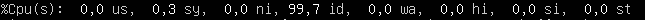
  

*  Загрузка памяти:
   -  Используется ОЗУ - 160.2 МБ
   -  Используется под кэш (хранение часто используемых областей диска) - 343.8 МБ \
   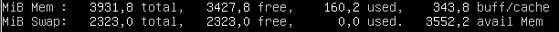
  

*  pid процесса занимающего больше всего памяти - 685 \
   
  

*  pid процесса, занимающего больше всего процессорного времени - 111 \
   
  
*  Запускаем утилиту htop командой `htop`
  

*  Вывод, отсортированный по PID \
   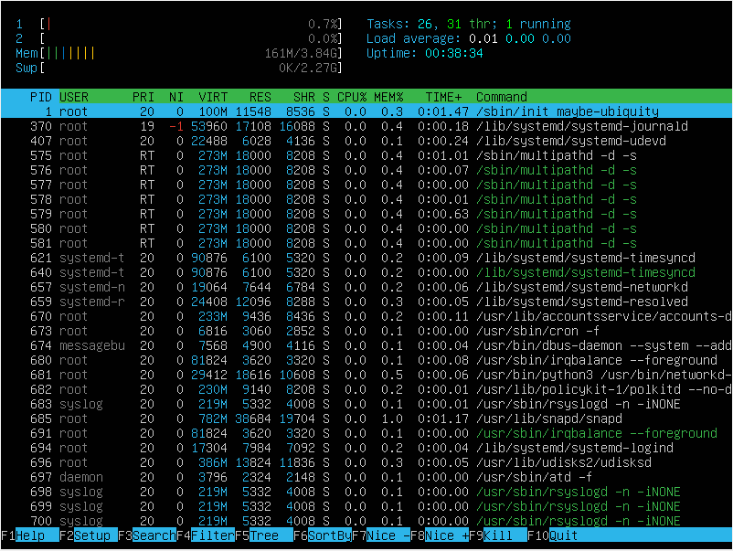

*  Вывод, отсортированный по PERCENT_CPU \
   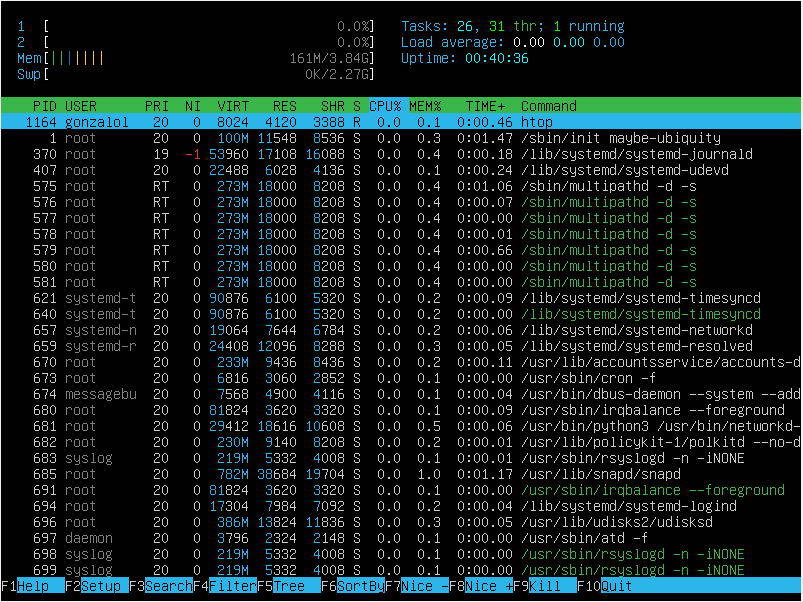

*  Вывод, отсортированный по PERCENT_MEM \
   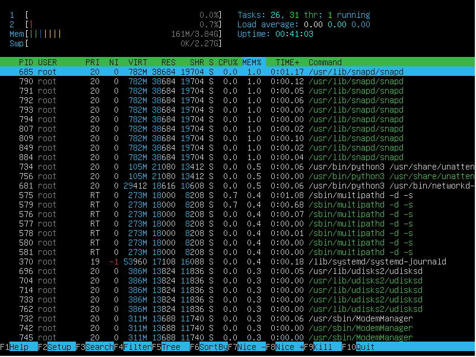

*  Вывод, отсортированный по TIME \
   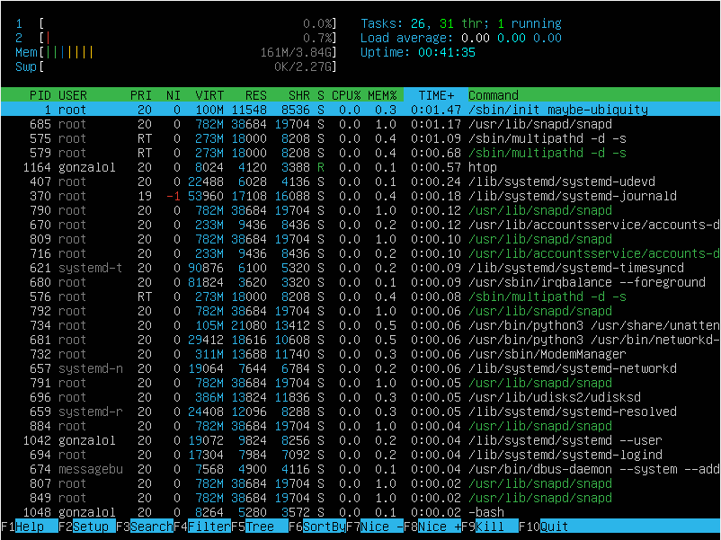
  

*  Вывод, отфильтрованный для процесса sshd \
   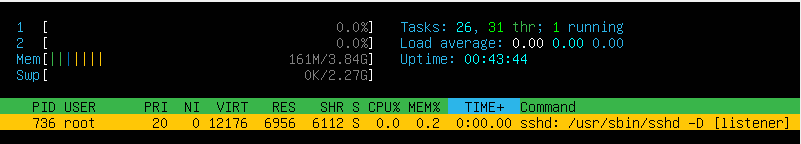
  

*  Вывод с процессом syslog, найденным, используя поиск \
   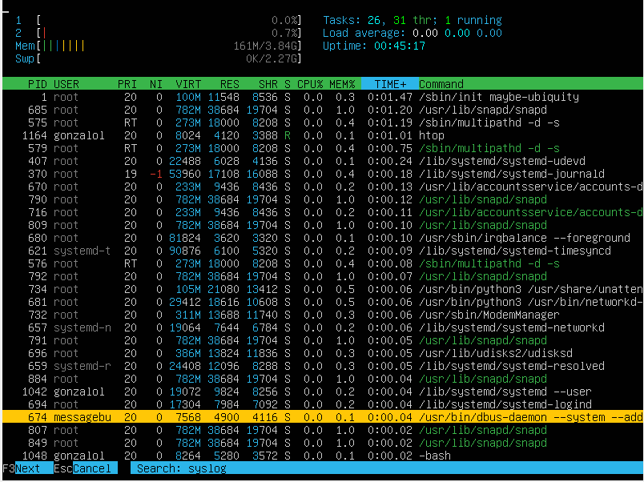
  

*  Вывод с добавленным выводом hostname, clock и uptime \
   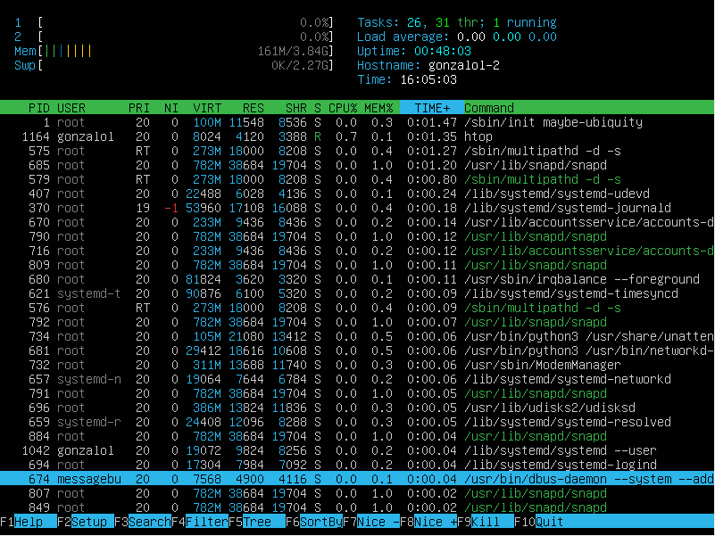

## Part 10. Использование утилиты fdisk
*  Используем команду `sudo fdisk -l` \
   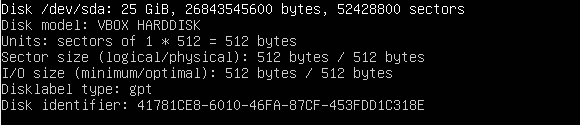
*  Название жесткого диска - sda, размер - 25 ГБ, количество секторов - 52428800, размер swap - 2323 МБ (из предыдущего раздела, команда `top`).

## Part 11. Использование утилиты df
**1. Запустить команду `df`**
*  Запускаем утилиту df командой `sudo df` \
   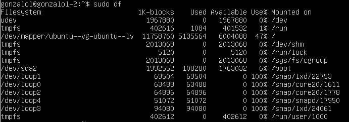
   -  Размер корневого раздела - 11758760
   -  Размер занятого пространства - 5135564
   -  Размер свободного пространства - 6004088
   -  Процент использования - 47
   -  Единица измерения - КБ

**2. Запустить команду `df -Th`**
*  Вводим команду `sudo df -Th` \
   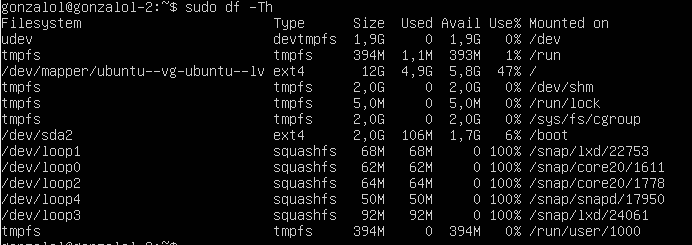
   -  Размер раздела: 12 ГБ
   -  Размер занятого пространства: 4.9 ГБ
   -  Размер свободного пространства: 5.8 ГБ
   -  Процент использования: 47%
   -  Тип файловой системы для раздела - ext4.

## Part 12. Использование утилиты du
*  Запускаем утилиту командой `sudo du` \
   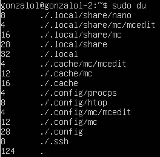
  
*  Выводим размеры папок /home и /var командой `sudo du -h -d 0 /home /var` \
   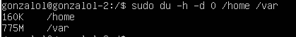
  

*  Выводим размер всего содержимого папки /var/log командой `sudo du -h -d 0 /var/log/*` \
   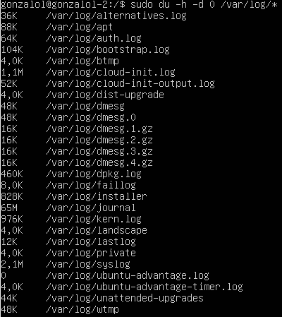

## Part 13. Установка и использование утилиты ncdu
*  Устанавливаем утилиту ncdu командой `sudo apt-get install ncdu`
  

*  Вывод размера папки /home `sudo ncdu /home` \
   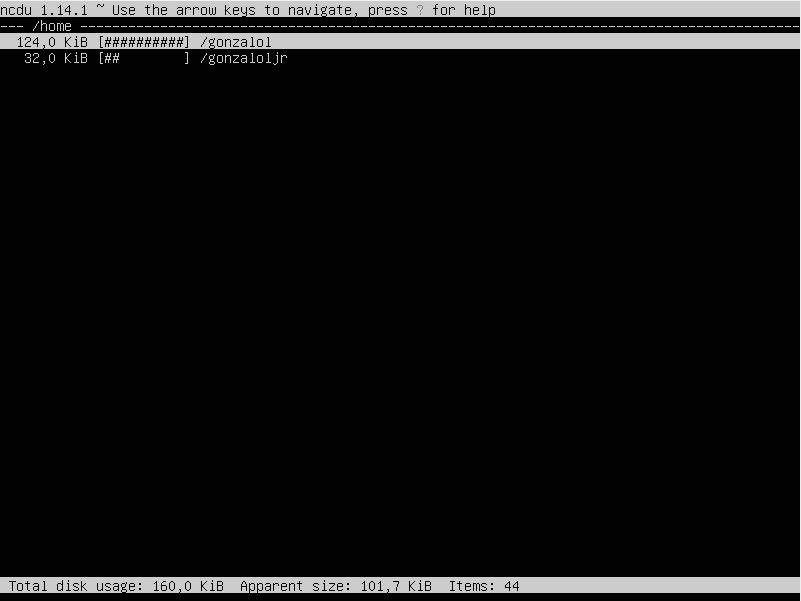
  

*  Вывод размера папки /var `sudo ncdu /var` \
   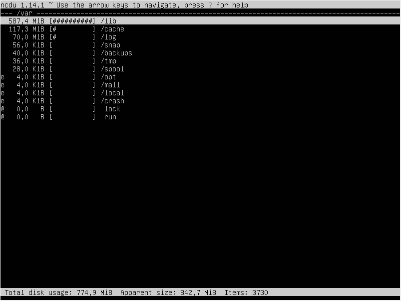

*  Вывод размера папки /var/log `sudo ncdu /var/log` \
   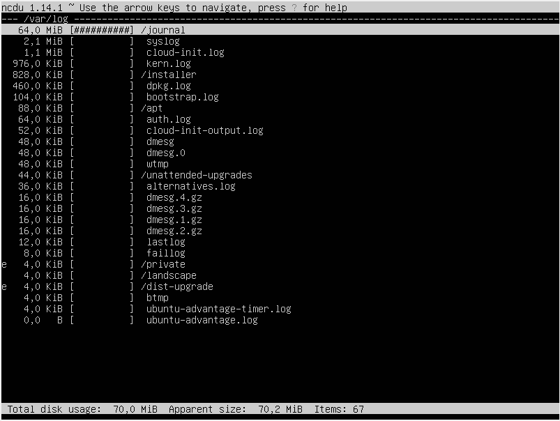

## Part 14. Работа с системными журналами
*  Открываем /var/log/dmesg для просмотра командой `less /var/log/dmesg` \
   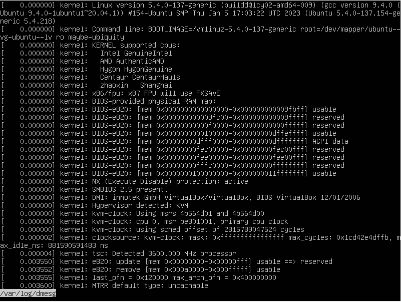
  

*  Открываем /var/log/syslog для просмотра командой `less /var/log/syslog` \
   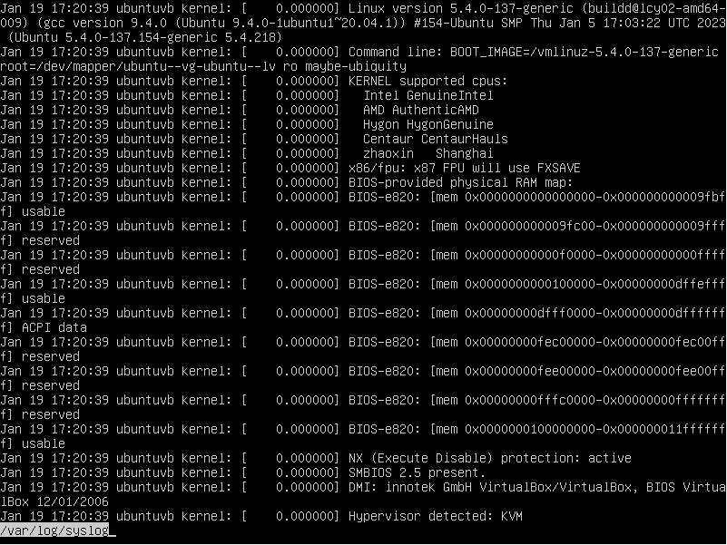
  

*  Открываем /var/log/auth.log для просмотра командой `less /var/log/auth.log` \
   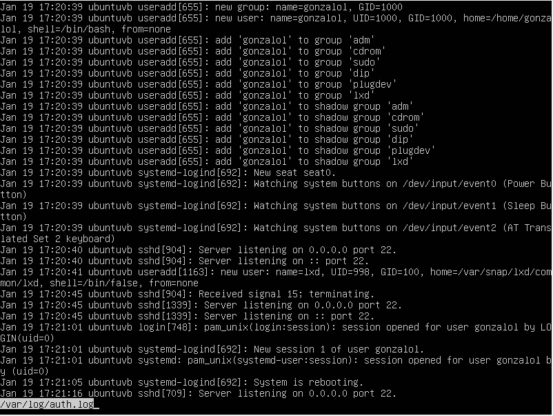
  

*  Находим время последней успешной авторизации, имя пользователя и метод входа в систему командой: `sudo grep -i login /var/log/auth.log` \
   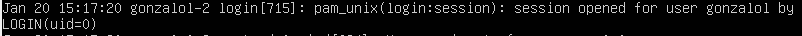
   -  Время последней успешной авторизации - 20 Января, 15:17:20
   -  Имя пользователя - gonzalol
   -  Метод входа в систему - LOGIN
  

*  Перезапускаем службу SSHd командой `sudo systemctl restart sshd`
*  Находим информацию о рестарте sshd службы в системном журнале auth.log командой `sudo grep restart /var/log/auth.log` \
   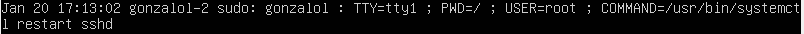

## Part 15. Использование планировщика заданий CRON
**1. Используя планировщик заданий, запустите команду uptime через каждые 2 минуты.**
*  Открываем планировщик заданий CRON командой `crontab -e` (флаг `-e` означает выбор текстового редактора по умолчанию)
*  Вписываем строку для задачи \
   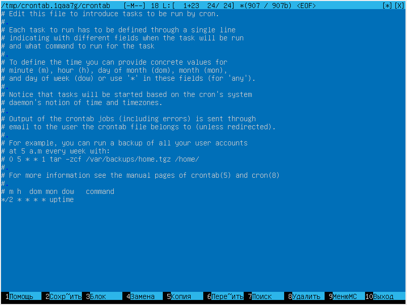
  

*  Проверяем последние записи журнала на наличие строк о выполнении команды uptime (2 раза с перерывом 2 минуты) командой `tail /var/log/syslog` \
   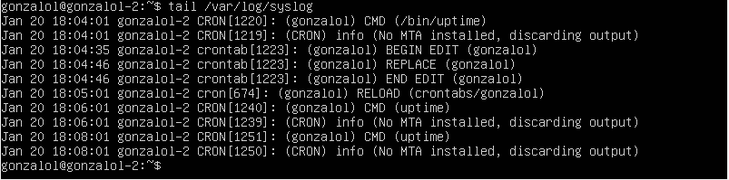
  

**2. Удалите все задания из планировщика заданий.**
*  Удаляем все задания для планировщика командой `crontab -r`
*  Проверяем список заданий командой `crontab -l` \
   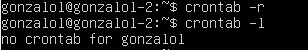
