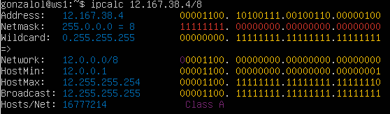
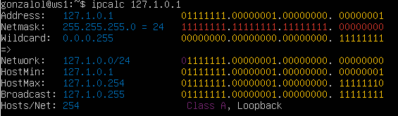
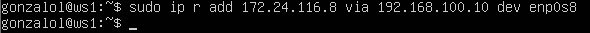
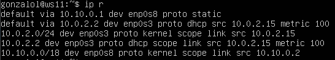
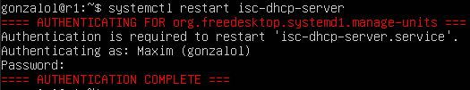

## Part 1. Инструмент ipcalc ##
### 1.1. Сети и маски ###
**1) Адрес сети 192.167.38.54/13**
* Устанавливаем утилиту ipcalc командой `sudo apt-get install ipcalc`
* Введём команду `ipcalc 192.167.38.54/13` \
  
  

* Адрес сети - `192.160.0.0/13`

**2) Перевод маски 255.255.255.0 в префиксную и двоичную запись, /15 в обычную и двоичную, 11111111.11111111.11111111.11110000 в обычную и префиксную**
* Введём команду `ipcalc 0.0.0.0/255.255.255.0` \
  
* Префиксная форма - `/24`, двоичная запись - `11111111.11111111.11111111.00000000`
  

* Введём команду `ipcalc 0.0.0.0/15` \
  
* Обычная форма - `255.254.0.0`, двоичная запись - `11111111.11111110.00000000.00000000`
  

* Переведём `11111111.11111111.11111111.11110000` в десятичную форму - `255.255.255.240`
* Введём команду `ipcalc 0.0.0.0/255.255.255.240` \
  
* Обычная форма - `255.255.255.240`, префиксная - `/28`

**3) Минимальный и максимальный хост в сети 12.167.38.4 при масках: /8, 11111111.11111111.00000000.00000000, 255.255.254.0 и /4**
* Введём команду `ipcalc 12.167.38.4/8` \
  
* Минимальный хост - `12.0.0.1`, максимальный хост - `12.255.255.254`
  

* Переведём `11111111.11111111.00000000.00000000` в десятичную форму - `255.255.0.0`
* Введём команду `ipcalc 12.167.38.4/255.255.0.0` \
  
* Минимальный хост - `12.167.0.1`, максимальный хост - `12.167.255.254`
  

* Введём команду `ipcalc 12.167.38.4/255.255.254.0` \
  
* Минимальный хост - `12.167.38.1`, максимальный хост - `12.167.39.254`
  

* Введём команду `ipcalc 12.167.38.4/4` \
  
* Минимальный хост - `0.0.0.1`, максимальный хост - `15.255.255.254`
  

### 1.2. localhost ###
**Определить и записать в отчёт, можно ли обратиться к приложению, работающему на localhost, со следующими IP: 194.34.23.100, 127.0.0.2, 127.1.0.1, 128.0.0.1**
* localhost - зарезервированное доменное имя для частных ip-адресов (диапазон `127.0.0.1` - `127.255.255.254`). Из этого можно сделать вывод, что обратиться можно будет только к приложениям, работающим с ip `127.0.0.2` и `127.1.0.1` из данного списка. Проверим:
  

* Введём команду `ipcalc 194.34.23.100` \
  
* Интерфейс `loopback` отсутствует в строке `Host/Net`, значит адрес нам не подходит.
  

* Введём команду `ipcalc 127.0.0.2` \
  
* Интерфейс `loopback` присутствует в строке `Host/Net`, значит адрес нам подходит.
  

* Введём команду `ipcalc 127.1.0.1` \
  
* Интерфейс `loopback` присутствует в строке `Host/Net`, значит адрес нам подходит.
  

* Введём команду `ipcalc 128.0.0.1` \
  
* Интерфейс `loopback` отсутствует в строке `Host/Net`, значит адрес нам не подходит.
  

### 1.3. Диапазоны и сегменты сетей ###
**1) Какие из перечисленных IP можно использовать в качестве публичного, а какие только в качестве частных: 10.0.0.45, 134.43.0.2, 192.168.4.2, 172.20.250.4, 172.0.2.1, 192.172.0.1, 172.68.0.2, 172.16.255.255, 10.10.10.10, 192.169.168.1**
* Выведем информацию о каждом ip адресе \
  
  

* В строке `Host/Net` наличие записи `Private Internet`, говорит о то, что ip адрес принадлежит частной сети.
* Адреса `134.43.0.2`, `172.0.2.1`, `192.172.0.1`, `172.68.0.2`, `192.169.168.1` можно использовать в качестве публичных.
* Адреса `10.0.0.45`, `192.168.4.2`, `172.20.250.4`, `172.16.255.255`, `10.10.10.10` можно использовать только в качестве частных.

**2) Какие из перечисленных IP адресов шлюза возможны у сети 10.10.0.0/18: 10.0.0.1, 10.10.0.2, 10.10.10.10, 10.10.100.1, 10.10.1.255**
* Введём команду `ipcalc 10.10.0.0/18` \
  
  

* Возможные адреса шлюза: `10.10.0.2`, `10.10.10.10`, `10.10.1.255`.
  

## Part 2. Статическая маршрутизация между двумя машинами ##
**1) Поднять две виртуальные машины (далее -- ws1 и ws2)** 
* Виртуальные машины ws1 и ws2 в работе \
  
  

**2) C помощью команды `ip a` посмотреть существующие сетевые интерфейсы** 
* Перед запуском машинам был добавлен второй адаптер с типом подключения "сетевой мост"
  

* Машина ws1 \
  
  

* Машина ws2 \
  
  

**3) Описать сетевой интерфейс, соответствующий внутренней сети, на обеих машинах и задать следующие адреса и маски: ws1 - 192.168.100.10, маска /16, ws2 - 172.24.116.8, маска /12**
* На каждой машине введём команду `sudo vim /etc/netplan/00-installer-config.yaml` и вносим изменения согласно заданию.
  

* Машина ws1 \
  
  

* Машина ws2 \
  
  

* На каждой машине вводим команду `sudo netplan apply`
  

* Машина ws1 \
  
  

* Машина ws2 \
  
  

### 2.1. Добавление статического маршрута вручную ###
**1) Добавить статический маршрут от одной машины до другой и обратно при помощи команды вида `ip r add`**
* Вводим на машине ws1 команду `ip r add 172.24.116.8 via 192.168.100.10 dev enp0s8` \
  
  

* Вводим на машине ws2 команду `ip r add 192.168.100.10 via 172.24.116.8 dev enp0s8` \
  
  
**2) Пропинговать соединение между машинами**
  

* Машина ws1 \
  
  

* Машина ws2 \
  
  

### 2.2. Добавление статического маршрута с сохранением ###
* Перезапускаем машины командой `reboot`
  
**1) Добавить статический маршрут от одной машины до другой с помощью файла etc/netplan/00-installer-config.yaml**
  

* Измененный файл `etc/netplan/00-installer-config.yaml` на ws1 \
  
  

* Измененный файл `etc/netplan/00-installer-config.yaml` на ws2 \
  

**2) Пропинговать соединение между машинами**
* Применяем изменения на обеих машинах командой `sudo netplan apply`, после чего воспользуемся командой `ping`
  

* Машина ws1 \
  

* Машина ws2 \
  
  

## Part 3. Утилита iperf3 ##
### 3.1. Скорость соединения ###
**Перевести и записать в отчёт: 8 Mbps в MB/s, 100 MB/s в Kbps, 1 Gbps в Mbps**
* 8 Mbps = 1 MB/s
* 100 MB/s = 819200 Kbps
* 1 Gbps = 1024 Mbps
  

### 3.2. Утилита iperf3 ###
**Измерить скорость соединения между ws1 и ws2**
* Пусть ws1 выступает в роли сервера, вводим команду `iperf3 -s -f m` \
  
  

* Пусть ws2 выступает в роли клиента, вводим команду `iperf3 -c 192.168.100.10 -f m` \
  
  

## Part 4. Сетевой экран ##
### 4.1. Утилита iptables ###
**Создать файл /etc/firewall.sh, имитирующий фаерволл, на ws1 и ws2:**

    #!/bin/sh

    # Удаление всех правил в таблице "filter" (по-умолчанию).  
    iptables -F  
    iptables –X  
  
**Нужно добавить в файл подряд следующие правила:**

**1) на ws1 применить стратегию когда в начале пишется запрещающее правило, а в конце пишется разрешающее правило (это касается пунктов 4 и 5)**

**2) на ws2 применить стратегию когда в начале пишется разрешающее правило, а в конце пишется запрещающее правило (это касается пунктов 4 и 5)**

**3) открыть на машинах доступ для порта 22 (ssh) и порта 80 (http)**

**4) запретить echo reply (машина не должна "пинговаться”, т.е. должна быть блокировка на OUTPUT)**

**5) разрешить echo reply (машина должна "пинговаться")**
* Содержимое файла /etc/firewall.sh машины ws1 \
  
  

* Содержимое файла /etc/firewall.sh машины ws2 \
  
  
**Запустить файлы на обеих машинах командами `chmod +x /etc/firewall.sh` и `/etc/firewall.sh`**
* Вводим указанные команды на машине ws1 \
  
  

* Вводим указанные команды на машине ws2 \
  
  
* Разница стратегий: поскольку применяется только первое подходящее правило, а остальные игнорируются, на машине ws1 для входящего пакета будет применяться запрет, а на ws2 - разрешение.
  

### 4.2. Утилита nmap ###
**Командой `ping` найти машину, которая не "пингуется", после чего утилитой `nmap` показать, что хост машины запущен**
* Пинг ws2 c ws1 \
  
  

* Пинг ws1 c ws2 и проверка хоста утилитой nmap (в выводе есть строка `Host is up`) \
  
  
## Part 5. Статическая маршрутизация сети ##
**Поднять пять виртуальных машин (3 рабочие станции (ws11, ws21, ws22) и 2 роутера (r1, r2))**
* Виртуальные машины в работе \
  
  

### 5.1. Настройка адресов машин ###
**1) Настроить конфигурации машин в `etc/netplan/00-installer-config.yaml` согласно сети на рисунке.**
* r1 \
  
  

* r2 \
  
  

* ws11 \
  
  

* ws21 \
  
  

* ws22 \
  
  

**2) Перезапустить сервис сети. Если ошибок нет, то командой ip -4 a проверить, что адрес машины задан верно. Также пропинговать ws22 с ws21. Аналогично пропинговать r1 с ws11.**
* Результат ввода команд на r1 \
  
  

* Результат ввода команд на r2 \
  
  

* Результат ввода команд на ws11 и пинг r1 \
  
  

* Результат ввода команд на ws21 и пинг ws22 \
  
  

* Результат ввода команд на ws22 \
  
  

### 5.2. Включение переадресации IP-адресов. ###
**1) Для включения переадресации IP, выполните команду на роутерах:**
`sysctl -w net.ipv4.ip_forward=1`
* Вывод команды на r1 \
  
  

* Вывод команды на r2 \
  

**2) Откройте файл /etc/sysctl.conf и добавьте в него следующую строку:**
`net.ipv4.ip_forward = 1`
* Измененный файл на r1 \
  
  

* Измененный файл на r2 \
  
  

### 5.3. Установка маршрута по-умолчанию ###
**1) Настроить маршрут по-умолчанию (шлюз) для рабочих станций. Для этого добавить default перед IP роутера в файле конфигураций**
* Файл `etc/netplan/00-installer-config.yaml` на ws11 \
  
  

* Файл `etc/netplan/00-installer-config.yaml` на ws21 \
  
  

* Файл `etc/netplan/00-installer-config.yaml` на ws22 \
  
  

* Также задаём шлюзы для роутеров, чтобы иметь доступ в соседнюю сеть
  
* Файл `etc/netplan/00-installer-config.yaml` на r1 \
  
  

* Файл `etc/netplan/00-installer-config.yaml` на r2 \
  
  

**2) Вызвать `ip r` и показать, что добавился маршрут в таблицу маршрутизации**
* На ws11 \
  
  

* На ws21 \
  
  

* На ws22 \
  
  

* На r1 \
  
  

* На r2 \
  
  
**3) Пропинговать с ws11 роутер r2 и показать на r2, что пинг доходит. Для этого использовать команду: `tcpdump -tn -i eth1`**
* Пинг роутера r2 с ws11 \
  
  

* Так как названия интерфейсов у нас не `eth0` и `eth1`, а `enp0s8` и `enp0s9`, меняем его на соответсвующее
* Пинг доходит до роутера r2 \
  
  

### 5.4. Добавление статических маршрутов ###
**1) Добавить в роутеры r1 и r2 статические маршруты в файле конфигураций. Пример для r1 маршрута в сетку 10.20.0.0/26:**

    # Добавить в конец описания сетевого интерфейса eth1:
    - to: 10.20.0.0  
    via: 10.100.0.12
  
* Файл на r1 \
  
  

* Файл на r2 \
  
  

**2) Вызвать `ip r` и показать таблицы с маршрутами на обоих роутерах. Пример таблицы на r1:**

    10.100.0.0/16 dev eth1 proto kernel scope link src 10.100.0.11
    10.20.0.0/26 via 10.100.0.12 dev eth1
    10.10.0.0/18 dev eth0 proto kernel scope link src 10.10.0.1
  
* Результат вызова для r1 \
  
  

* Результат вызова для r2 \
  

**3) Запустить команды на ws11:**
`ip r list 10.10.0.0/[маска сети]` и `ip r list 0.0.0.0/0`
  

* Результат вызова \
  
  
* Для адреса `10.10.0.0/18` был выбран маршрут, отличный от `0.0.0.0/0`, так как маршрут по-умолчанию имеет более низкий приоритет, чем маршрут, указанный в таблице маршрутизации. Поскольку для сети `10.10.0.0` нами было создано правило, созданный маршрут был использован.
  

### 5.5. Построение списка маршрутизаторов ###
**Запустить на r1 команду дампа: `tcpdump -tnv -i eth0`**
* В нашем случае имя сетевого интерфейса `enp0s8`
  
**При помощи утилиты traceroute построить список маршрутизаторов на пути от ws11 до ws21**
* Устанавливаем утилиту traceroute командой `sudo apt-get install traceroute`
  

* Вызываем команду `traceroute 10.20.0.10` на ws11 \
  
  

* Вывод на роутере r1 \
  
  
* Принцип работы traceroute :
  
  Для определения промежуточных маршрутизаторов traceroute отправляет серию пакетов данных целевому узлу, при этом каждый раз увеличивая на 1 значение поля TTL («время жизни»). Это поле обычно указывает максимальное количество маршрутизаторов, которое может быть пройдено пакетом. Первый пакет отправляется с TTL, равным 1, и поэтому первый же маршрутизатор возвращает обратно сообщение ICMP, указывающее на невозможность доставки данных. Traceroute фиксирует адрес маршрутизатора, а также время между отправкой пакета и получением ответа (эти сведения выводятся на монитор компьютера). Затем traceroute повторяет отправку пакета, но уже с TTL, равным 2, что позволяет первому маршрутизатору пропустить пакет дальше. Процесс повторяется до тех пор, пока при определённом значении TTL пакет не достигнет целевого узла. При получении ответа от этого узла процесс трассировки считается завершённым.
  

### 5.6. Использование протокола ICMP при маршрутизации ###
**1) Запустить на r1 перехват сетевого трафика, проходящего через eth0 с помощью команды: `tcpdump -n -i eth0 icmp`**

**2) Пропинговать с ws11 несуществующий IP (например, `10.30.0.111`) с помощью команды: `ping -c 1 10.30.0.111`**
* Вывод на r1 \
  
  

* Вывод на ws11 \
  
  

## Part 6. Динамическая настройка IP с помощью DHCP ##
**Для r2 настроить в файле `/etc/dhcp/dhcpd.conf` конфигурацию службы DHCP:**
* Сначала скачаем `isc-dhcp-server` командой `sudo apt install isc-dhcp-server`
  

**1) Указать адрес маршрутизатора по-умолчанию, DNS-сервер и адрес внутренней сети.**
* Измененный файл `/etc/dhcp/dhcpd.conf` на r2 \
  
  

**2) В файле resolv.conf прописать nameserver 8.8.8.8.**
* Измененный файл `/etc/resolv.conf` на r2 \
  
  

**3) Перезагрузить службу DHCP командой `systemctl restart isc-dhcp-server`. Машину ws21 перезагрузить при помощи `reboot` и через `ip a` показать, что она получила адрес. Также пропинговать ws22 с ws21.**
* Перезагрузка службы DHCP на r2 \
  
  

* Перезагружаем машину ws21 командой `reboot` и вызываем команду `ip a`, видим, что ip-адрес получен (`10.20.0.11`) \
  
  

* Пинг ws22 с ws21 \
  
  

**4) Указать MAC адрес у ws11, для этого в `etc/netplan/00-installer-config.yaml` надо добавить строки: `macaddress: 10:10:10:10:10:BA`, `dhcp4: true`**
* Измененный файл `/etc/netplan/00-installer-config.yaml` на ws11 \
  
  

**Для r1 настроить аналогично r2, но сделать выдачу адресов с жесткой привязкой к MAC-адресу (ws11). Провести аналогичные тесты**
* Устанавливаем `ics-dhcp-server` на роутер r1 и вносим изменения в файл `/etc/dhcp/dhcpd.conf` \
  
  

* Измененный файл `/etc/resolv.conf` на r1 \
  
  

* Перезагружаем службу DHCP командой `systemctl restart isc-dhcp-server` \
  
  

* Перезагружаем машину ws11 командой `reboot` и вызываем `ip a` (видим, что ip-адрес изменился на заданый нами - `10.10.0.51`) \
  
  

* Пинг ws22 с машины ws11 \
  
  

**5) Запросить с ws21 обновление ip адреса**
* `ip a` на ws21 до обновления \
  
  

* Сначала вызовем команду `sudo dhclient enp0s8 -r` (флаг `-r` позволяет очистить список ip-адресов), после чего вызываем `sudo dhclient enp0s8` для обновления адреса
* `ip a` на ws21 после обновления \
  
  

## Part 7. NAT ##
**1) В файле `/etc/apache2/ports.conf` на ws22 и r1 изменить строку `Listen 80` на `Listen 0.0.0.0:80`, то есть сделать сервер Apache2 общедоступным**
* Измененный файл на ws22 \
  
  

* Измененный файл на r1 \
  
  

**2) Запустить веб-сервер Apache командой `service apache2 start` на ws22 и r1**
* Выполнение команды на ws22 \
  
  

* Выполнение команды на r1 \
  
  

**3) Добавить в фаервол, созданный по аналогии с фаерволом из Части 4, на r2 следующие правила:**
1) Удаление правил в таблице filter - iptables -F
2) Удаление правил в таблице "NAT" - iptables -F -t nat
3) Отбрасывать все маршрутизируемые пакеты - iptables --policy FORWARD DROP
  

* Содержимое файла `/etc/firewall.sh` на r2 \
  
  

* Запускаем firewall.sh на r2 \
  
  

* Проверяем соединение между ws22 и r1 командой `ping` (не должно пинговаться) \
  
  

**4) Разрешить маршрутизацию всех пакетов протокола ICMP**
* Добавляем ещё одно правило в `/etc/firewall.sh` на r2 \
  
  

* Запускаем firewall.sh на r2 \
  
  

* Проверяем соединение между ws22 и r1 командой `ping` (должно пинговаться) \
  
  

**5) Включить SNAT, а именно маскирование всех локальных ip из локальной сети, находящейся за r2 (по обозначениям из Части 5 - сеть 10.20.0.0)**

**6) Включить DNAT на 8080 порт машины r2 и добавить к веб-серверу Apache, запущенному на ws22, доступ извне сети**
* Содержимое файла `/etc/firewall.sh` на r2 \
  
  

* Запускаем firewall.sh на r2 \
  
  

* Проверяем соединение по TCP для SNAT, для этого с ws22 подключиться к серверу Apache на r1 командой `telnet [адрес] [порт]` \
  
  

* Проверить соединение по TCP для DNAT, для этого с r1 подключиться к серверу Apache на ws22 командой `telnet` (обращаться по адресу r2 и порту 8080) \
  
  

## Part 8. Дополнительно. Знакомство с SSH Tunnels ##
**1) Запустить на r2 фаервол с правилами из Части 7**
* Содержимое файла `/etc/firewall.sh` на роутере r2 \
  
  

* Запускаем `/etc/firewall.sh` \
  
  

**2) Запустить веб-сервер Apache на ws22 только на localhost (то есть в файле `/etc/apache2/ports.conf` изменить строку `Listen 80` на `Listen localhost:80`)**
* Измененный файл `/etc/apache2/ports.conf` на ws22 \
  
  

* Запускаем сервер Apache командой `service apache2 start` на ws22 \
  
  

**3) Воспользоваться Local TCP forwarding с ws21 до ws22, чтобы получить доступ к веб-серверу на ws22 с ws21**
* Воспользуемся командой `ssh -L 2222:localhost:80 10.20.0.20` на машине ws21 \
  
  

* Проверим, сработало ли подключение (переходим в другой терминал сочетанием клавиш `Alt` + `F2` и вводим команду `telnet 127.0.0.1 2222`) \
  
  

**4) Воспользоваться Remote TCP forwarding c ws11 до ws22, чтобы получить доступ к веб-серверу на ws22 с ws11**
* Воспользуемся командой `ssh -R 2222:localhost:80 10.20.0.20` на машине ws21 \
  
  

* Проверим, сработало ли подключение \
  
  
