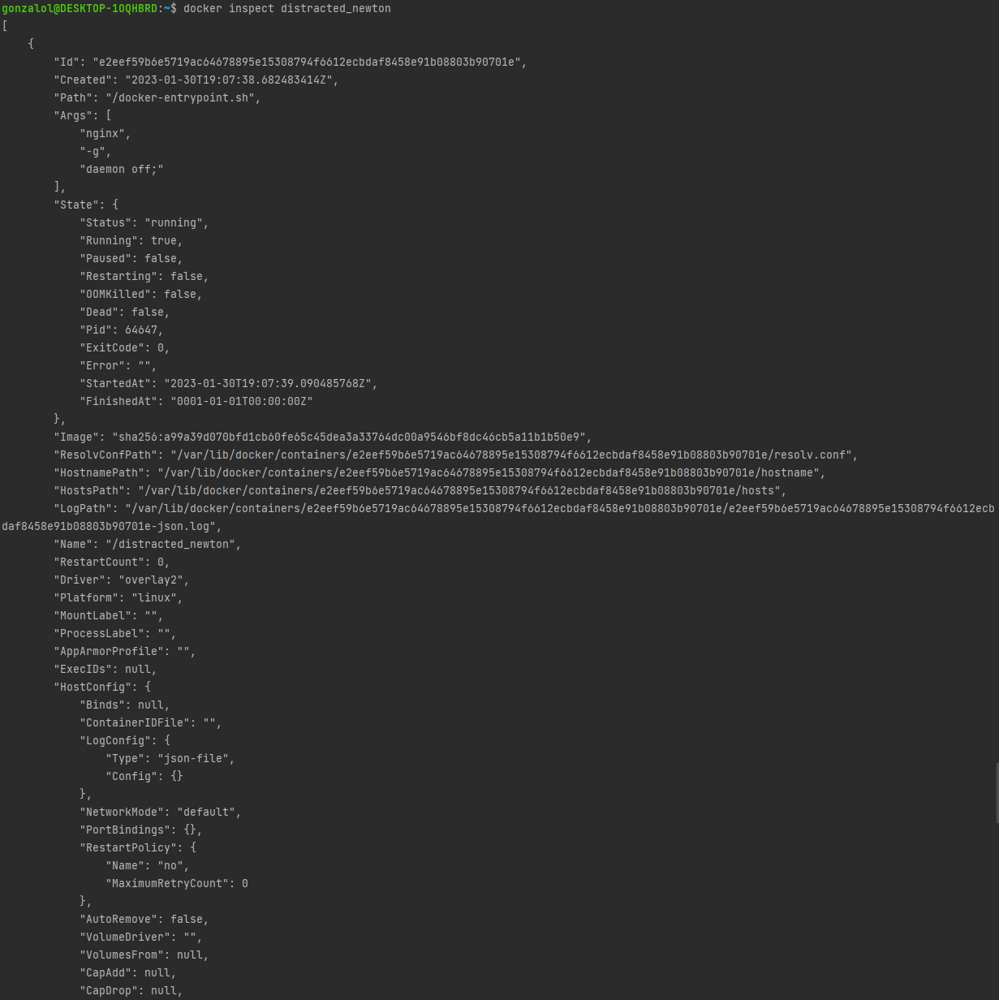
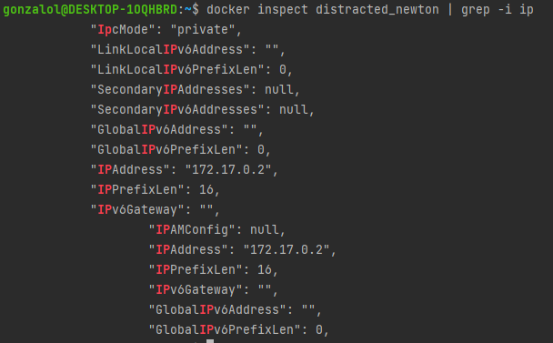

## Part 1. Готовый докер ##

* Так как docker engine не установлен, устанавливаем его согласно инструкции на сайте `https://docs.docker.com/engine/install/ubuntu/`
  

* Проверим, успешна ли установка командой `sudo docker run hello-world`\
  
  

* Выкачиваем официальный докер образ с nginx командой `sudo docker pull nginx` \
  
  

* Проверим наличие докер образа через `docker images` \
  
  

* Запустим докер образ командой `docker run -d [image_id|repository]` \
  
  

* Проверим, что образ запустился командой `docker ps` \
  
  

* Посмотрим информацию о контейнере командой `docker inspect [container_id|container_name]` \
  
  

**По выводу команды определить размер контейнера, список замапленных портов и ip контейнера**
  

* Найдём размер контейнера (в байтах), для удобства воспользуемся командой `docker inspect distracted_newton -s | grep -i sizerw` \
  
  

* Список замапленных портов с помощью `grep` достать не удалось (сами порты прописаны ниже), находим вручную \
  
  

* Найдём ip-адрес контейнера, для удобства воспользуемся командой `docker inspect distracted_newton | grep -i ip` \
  
  

* Остановим докер образ командой `docker stop [container_id|container_name]` и проверим, что он остановился командой `docker ps` \
  
  

* Запустим докер с замапленными портами `80` и `443` на локальную машину командой `docker run -d -p 127.0.0.1:80:80 -p 127.0.0.1:443:443 nginx` и проверим, что он запустился командой `docker ps` \
  
  

* Проверим, что в браузере по адресу `localhost:80` доступна стартовая страница nginx \
  
  

* Перезапустим докер контейнер командой `docker restart [container_id|container_name]` и проверим, что он перезапустился командой `docker ps` \
  
  

## Part 2. Операции с контейнером ##
**Прочитать конфигурационный файл nginx.conf внутри докер контейнера через команду exec**
  

* Для начала определим его местоположение командой `docker exec wonderful_nightingale find -type f 2>/dev/null | grep nginx.conf` \
  
  

* Просмотрим файл командой `docker exec wonderful_nightingale cat /etc/nginx/nginx.conf` \
  
  

* Создадим на локальной машине файл nginx.conf командой `touch nginx.conf` и проверим его наличие командой `ls` \
  
  

* По ошибке файл был создан не в директории проекта, переходим в рабочую директорию и переносим файл туда \
  
  

* Скопируем данные из файла `nginx.conf`, находящегося в контейнере, в наш файл и внесём изменения в блок `http` для настройки в нём по пути `/status` отдачи страницы статуса сервера nginx \
   
* Добавили блок `server` с необходимыми параметрами и закомментировали строку `include /etc/nginx/conf.d/*.conf;`, так как с ней статус не отображался
  

* Скопируем файл внутрь докер образа командой `docker cp nginx.conf wonderful_nightingale:/etc/nginx/nginx.conf` и перезапустим nginx внутри докер образа командой `docker exec wonderful_nightingale nginx -s reload` \
  
  

* Проверяем, что по адресу `localhost:80/status` отображается страничка со статусом сервера nginx \
  
  

* Экспортируем контейнер в файл container.tar командой `docker export -o container.tar wonderful_nightingale` \
  
   

* Остановим контейнер и проверим, что он остановился \
  
  

* Удаляем образ через `docker rmi [image_id|repository]`, не удаляя перед этим контейнеры \
  
  

* Удаляем остановленный контейнер командой `docker rm wonderful_nightingale` и проверяем, что он удалился, командой `docker ps -a` \
  
* Видим, что с прошлых заданий остались ещё контейнеры, удаляем их тем же способом, а также образ `hello_world`, оставшийся с проверки установки docker
  

* Импортируем контейнер обратно командой `docker import --change 'CMD ["nginx", "-g", "daemon off;"]' container.tar container` и проверим, что образ создался, командой `docker images` \
  
  

* Теперь запускаем его командой `docker run -d -p 127.0.0.1:80:80 -p 127.0.0.1:443:443 container` и проверяем командой `docker ps` \
  
  

* Проверим, что по адресу `localhost:80/status` отдается страничка со статусом сервера nginx \
  
  
