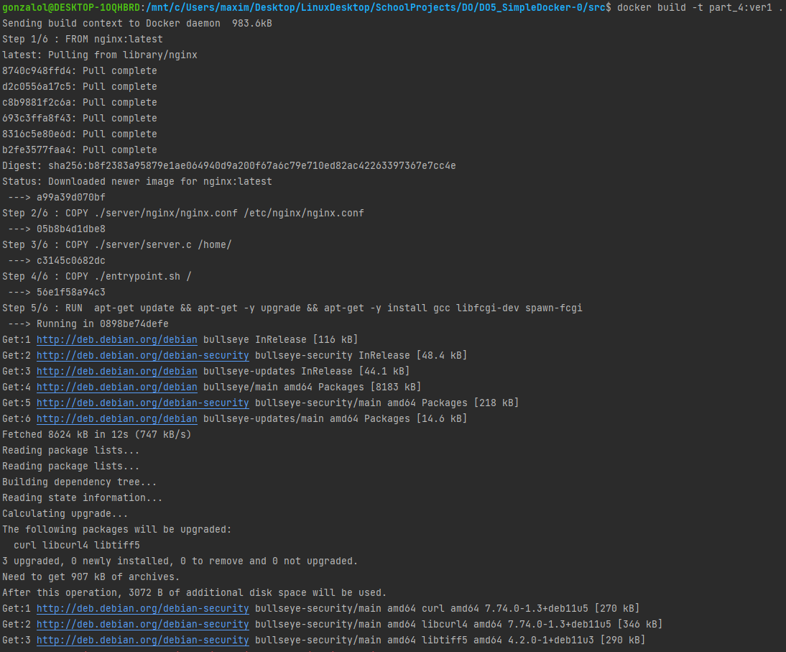
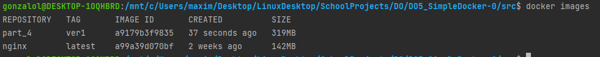

## Part 3. Мини веб-сервер ##

* Первым делом качаем образ nginx и запускаем контейнер с замапленным 81 портом \
  
  

* Напишем минисервер на C и FastCGI, который будет возвращать страницу с надписью `Hello World!` \
  
  

* Напишем свой nginx.conf, который будет проксировать все запросы с `81` порта на `127.0.0.1:8080` \
  
  

* Скопируем сервер и nginx.conf в контейнер \
  
  

* Для входа в контейнер воспользовался командой `docker exec -it zen_taussig bash`
* Для написания сервера потребовалось установить библиотеку libfcgi. Также установим её в контейнер + gcc для возможности компилирования С файлов и утилиту spawn-fcgi для запуска сервера.
* Все использованные команды после входа в контейнер: `apt update`, `apt upgrade`, `apt install gcc`, `apt install libfcgi-dev`, `apt install spawn-fcgi`
  
* Скомпилируем и запустим сервер с помощью `spawn-fcgi` и перезагрузим nginx\
  
  

* Проверим, что страничка отображается по `localhost:81` \
  
  

## Part 4. Свой докер ##
* Напишем свой Dockerfile, в качестве базового образа будем использовать последнюю версию nginx (указываем после инструкции `FROM`)
* После инструкции `COPY` указываем файлы, которые хотим копировать внутрь контейнера (нам нужен конфиг nginx и сервер, написанные нами в 3-ей части, а также скрипт `entrypoint.sh`, который будет выполнять роль entrypoint)
* После инструкции `RUN` указываем команды, которые необходимо выполнить после создания образа (используем для обновления и установки необходимых нам пакетов)
* И наконец, инструкция `CMD` указывает, какую команду необходимо выполнить после запуска контейнера (в данном случае это наш скрипт `entrypoint.sh`, в котором указаны команды для сборки и запуска нашего сервера и команда `nginx -g "daemon off;"`, необходимая для того, чтобы контейнер после запуска продолжал работать)
  

* Dockerfile \
  
  

* entrypoint.sh \
  
  

* Соберём образ с помощью нашего Dockerfile, указав также имя и тег, командой `docker build -t part_4:ver1 .` \
  
  

* Проверим наличие нашего образа командой `docker images` \
  
  

* По заданию, нам необходимо запустить контейнер с маппиногом `81` порта на `80` и маппингом папки `./nginx` внутрь контейнера по адресу `/etc/nginx`
* Для маппинга папки нам необходмо сначала достать её из образа на локальную машину, поэтому запустим контейнер для экспорта командой `docker run -d part_4:ver1` и проверим командой `docker ps` \
  
  

* Теперь остановим контейнер командой `docker stop affectionate_pare` и получим архив с файловой системой командой `docker export -o container.tar affectionate_pare` и удалим контейнер командой `docker rm affectionate_pare` \
  
  

* Содержимое `/etc/nginx` в архиве \
  
  

* Распаковываем командой `tar -xvf container.tar etc/nginx` \
  
  

* Запускаем контейнер с маппингом порта и папки по заданию \
  
  

* Проверяем в браузере, что по `localhost:80` нам доступна стартовая страничка nginx \
  
  

* Добавим в `nginx.conf` (в тот, что в `src/nginx/`) проксирование странички `/status`, по которой будем отдавать статус сервера nginx \
  
  

* Перезапустим докер образ `docker restart ` \
  
  

* Проверим, что теперь по `localhost:80/status` отдается страничка со статусом nginx \
  
  

## Part 5. Dockle ##
* Устанавливаем dockle \
  
  

* Проверяем наш образ командой `sudo dockle part_4:ver1` \
  
  

* Чтобы исправить `CIS-DI-0005` используем команду `export DOCKER_CONTENT_TRUST=1` \
  
  

* Перепишем наш Dockerfile, чтобы избавиться от ошибок `DKL-DI-0005`, `CIS-DI-0001`, `CIS-DI-0006` и `CIS-DI-0008`:
* Добавим в инструкцию `RUN` команду `rm -rf /var/lib/apt/lists` для очистки кэша apt-get
* Добавим инструкцию `USER`, в которой укажем не root пользователя
* Добавим инструкцию `HEALTHCHECK`, проверяющую подключение к localhost (то есть работу нашего сервера nginx) каждые 5 минут
* Добавим в инструкцию `RUN` установку UID и GID директориям, которым требуется
  

* Измененный Dockerfile \
  
* Также был изменен владелец на пользователя nginx всех директорий, к которым необходим доступ
  

* С ошибкой `CIS-DI-0010` нам не справиться, связана она с переменной среды `NGINX_GPGKEY`. Сам dockle предлагает нам её подавить с помощью ключа `--accept-key`.
  

* Cоздадим новый образ командой `docker build -t part_5:ver2 .` и проверим, что он создался, командой `docker images` \
  
  

* Проверим образ командой `dockle --accept-key NGINX_GPGKEY part_5:ver2` \
  
  

* Чтобы не подавлять ошибку, попробуем взять образ `ubuntu/nginx`
* Сначала создадим образ без копирования файла `nginx.conf`, чтобы получить измененный файл
  

* Измененный Dockerfile \
  

* Далее запакуем файловую систему в архив и вытащим папку `/etc/nginx` в нашу рабочую директорию `src` для последующего маппинга (старую переименуем в `nginx_part_4`)
  

* Новый `nginx.conf` \
  
  

* Внесём в него необходимые изменения по заданию части 4 \
  
  

* Раскомментируем строку с копированием nginx.conf в Dockerfile \
  
  

* Удалим все старые контейнеры и образы, и создадим новый (тег теперь - ver3) `sudo docker build -t part_5:ver3 .`
* Проверяем наличие образа \
  
  

* Запустим контейнер командой `sudo docker run -d -p 127.0.0.1:80:81 -v $(pwd)/nginx/:/etc/nginx/ part_5:ver3`
* Проверяем командой `docker ps` \
  
  

* Проверим в браузере странички `localhost:80` и `localhost:80/status` \
  
  

* И наконец, проверим образ командой `dockle part_5:ver3` \
  
  

## Part 6. Базовый Docker Compose ##
* Создадим папку `06`, где будем хранить Dockerfile, entrypoint.sh для запуска второго контейнера и папку nginx
  

* Dockerfile \
  
  

* entrypoint.sh (вызываем команду, чтобы контейнер не останавливался после запуска) \
  
  

* Напишем `docker-compose.yml` \
  
  

* Впишем настройки проксирования в nginx.conf \
  
  

* Удалим все старые контейнеры и образы
* Проверим, что ничего не осталось \
  
  

* Введём команды `sudo docker-compose build` и `sudo docker-compose up` (предварительно установили `docker-compose`) \
  
  

* Проверим, что в браузере по `localhost:80` отдается написанная нами страничка \
  
  
