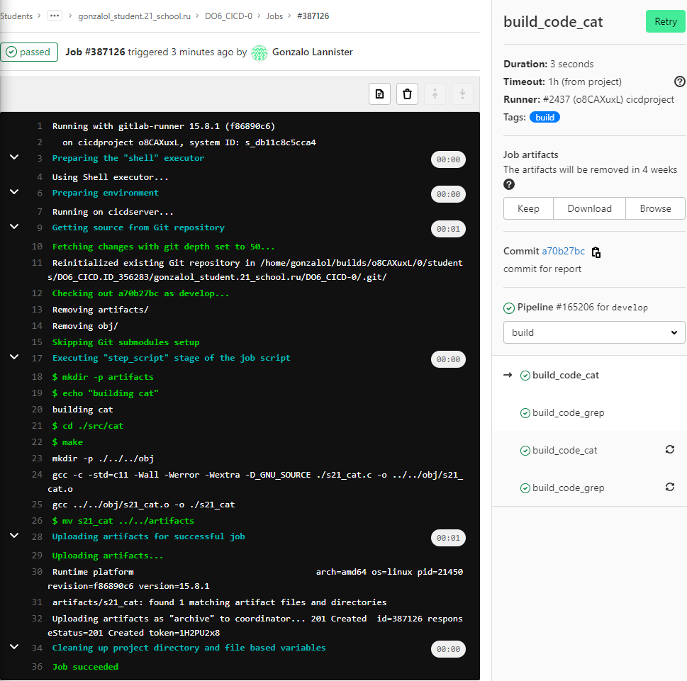
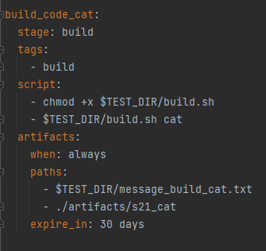

## Part 1. Настройка gitlab-runner ##
* Устанавливаем gitlab-runner по интсрукции на сайте `https://docs.gitlab.com/runner/install/linux-repository.html` \
  
  

* Устанавливаем с помощью `sudo apt-get install gitlab-runner` и проверяем версию командой `gitlab-runner --version` \
  
  

* Регистрируем раннер командой `sudo gitlab-runner register` \
  
  

## Part 2. Сборка ##
* Напишем `.gitlab-ci.yml` для сборки проекта `SimpleBash`, сам проект склонируем и положим в `src` \
  
* Файлы после сборки будем сохранять в папке `artifacts`
  

* Запустим gitlab-runner командой `sudo gitlab-runner run` и запушим проект (также предварительно установили на ВМ `gcc` и `make` для сборки проекта) \
  

  
  

* Смотрим результат в gitlab \
  

  

  
  

## Part 3. Тест кодстайла ##
* Первым делом установим `clang-format` на ВМ
  

* Дополним наш `.gitlab-ci.yml` следующими строками \
  
  

* Попортим файл `s21_grep.c`, чтобы тест стиля кода выдавал ошибки, запушим и проверим pipeline \
  
* Как видим, тест стиля grep не пройден, весь пайплайн зафейлен
  

* Посмотрим вывод для теста стиля grep (job: style_code_grep) \
  
* Видим вывод утилиты `clang-format`
  

## Part 4. Интеграционные тесты ##
* Напишем скрипты тестов (папка src/tests)
  
* В `.gitlab-ci.yml` добавим следующие jobs (а также stage: test) \
  
  

* Коммитим, пушим и видим, что появилась новая стадия в пайплайне. (Стадия не запускается, если зафейлен build или style)
  

## Part 5. Этап деплоя ##
* Первым делом поднимем вторую виртуальную машину, добавим обеим по адаптеру типа "Сетевой мост" и настроим `/etc/netplan/00-installer-config.yaml`.
  

* Настройки на обеих машинах \
  
  

* Применили, проверили с помощью ping. Подключились к машине prod с cicdserver с помощью `ssh gonzalol@196.168.1.105`. Всё работает хорошо. \
  
  

* Теперь добавим следующую стадию deploy в `.gitlab-ci.yml` и новый job \
  
  

* Скрипт для копирования артефактов (вторая строка для того, чтобы показать, что файлы действительно скопировались на вторую машину) \
  
  

* После коммита и пуша видим новую стадию deploy в пайплайне. Запуск возможен только вручную и только в случае успеха всех предыдущих стадий. \
  
  

* Видим проблему, связанную с необходимостью введения пароля при подключении
  

* Меняем пароль от пользователя `gitlab-runner` командой `sudo passwd gitlab-runner` и переходим на него командой `su gitlab-runner` предварительно добавиви его в sudoers (команда `sudo visudo` и добавляем следующиее) \
  
* Это позволит данному пользователю использовать sudo и не вводить пароль
  

* Теперь можем сгенерировать ключ `ssh-keygen` и командой `ssh-copy-id gonzalol@192.168.1.105` копируем ключ на машину, к которой будем подключаться по ssh.
  

* Далее пробуем подключиться командой `ssh gonzalol@192.168.1.105` и видим, что пароль теперь не требуется
  

* Снова пушим и после запуска deploy стадии снова сталкиваемся с проблемой - нет разрешения на копирование в директорию `/usr/local/bin`
  

* Решаем данную проблему, дав права на данную директорию пользователю `gitlab-runner` командой `sudo chmod -R 777 /usr/local/bin`
  

* Пробуем снова, всё работает \
  
  

## Part 6. Дополнительно. Уведомления ##
* Первым делом создали своего бота с помощью `@BotFather`
  

* В каждом job были дополнены скрипты получением статуса выполнения и записью его в файл (и вынесены в отдельный файл, вместо написания непосредственно в `.gitlab-ci.yml`). 
* Как пример - скрип build стадии \
  
  

* Сами файлы добавлены в artifacts. (также пример на основе стадии build) \
  
  

* Добавлен stage `notify` и два job - на успешное и неуспешное выполнение пайплайна (в данном случае этапа ci, то есть стадия выполняется раньше стадии deploy). \
  
  

* Скрипт в `notify` собирает все артефакты с записями о статусах работ и записывает их в общий файл, после чего передаёт его скрипту для отправки сообщения ботом.
* В сам скрипт сообщения от бота (взяли из materials) внесли изменения, а именно добавили переменные `TELEGRAM_BOT_TOKEN` и `TELEGRAM_USER_ID` (один от `@BotFather`, второй от `@myidbot`), а также изменили сообщение (первым параметром теперь ему требуется файл с сообщением, а не статус).
* Стадия `deploy` отдельно вызывает скрипты для получения сообщения от бота.
  
* Пример сообщений \
  
